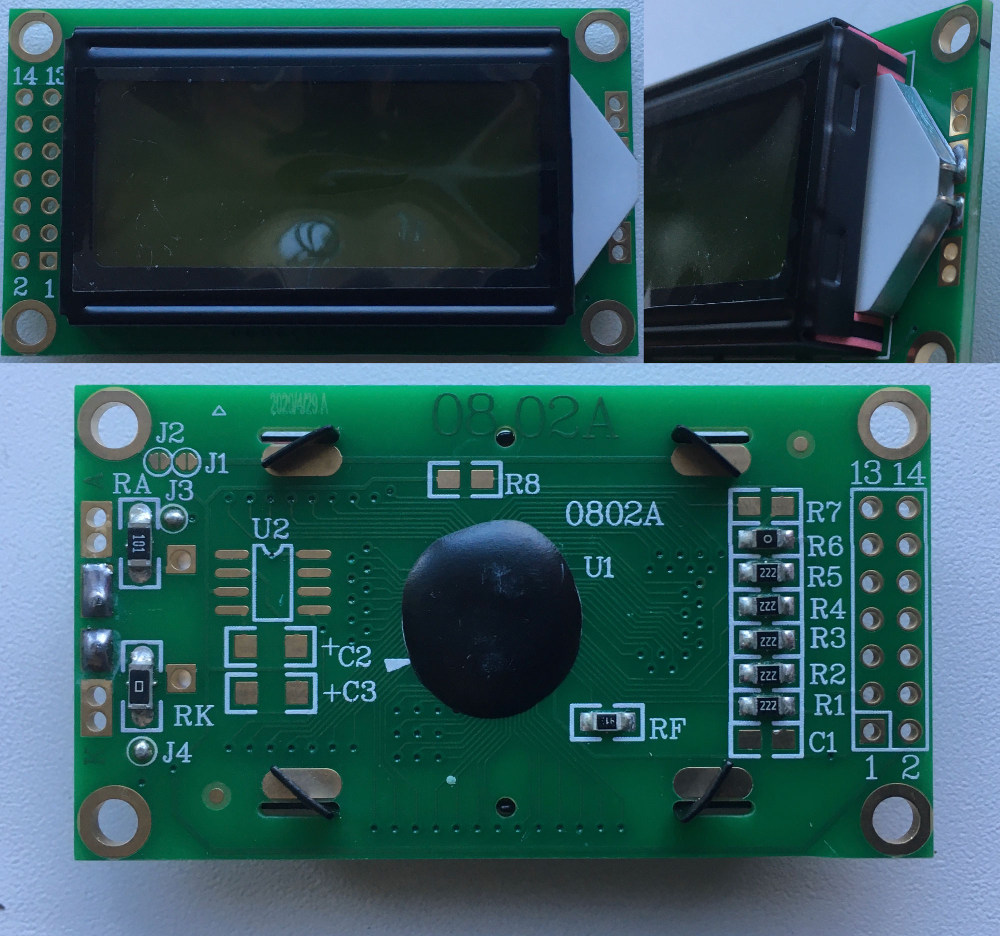
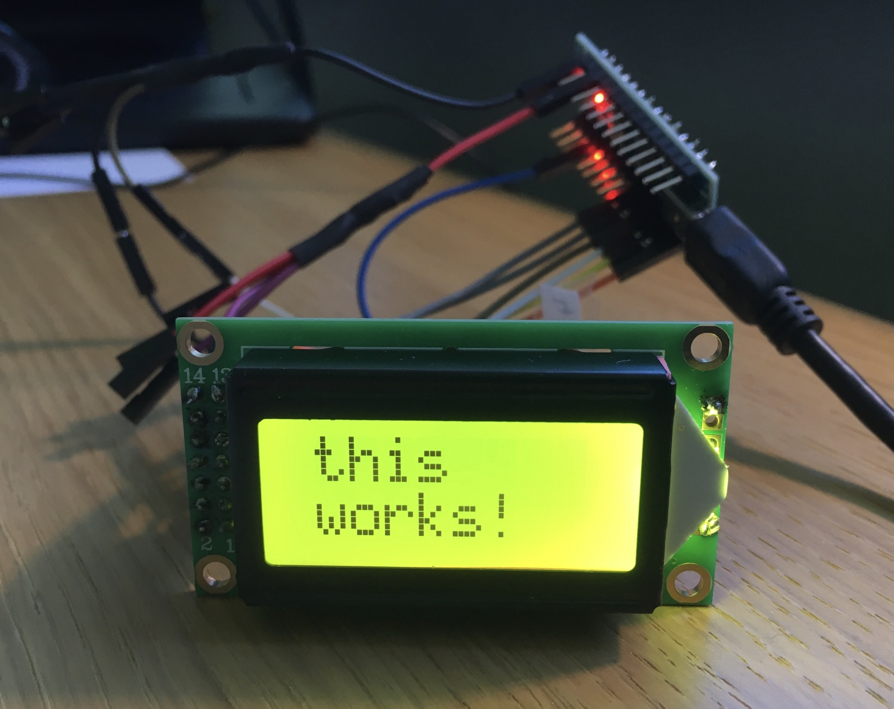
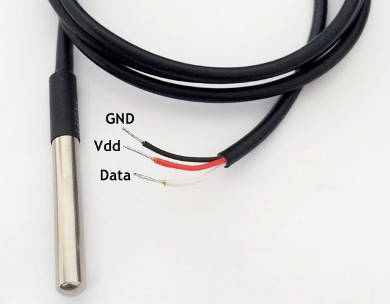

### Setting up and assembling a basic programmable thermostat with a small LCD display which senses the temperature of a physical system and performs actions so that the system's temperature is maintained near a desired setpoint. 
### A work in progress...

# Setting everything up

## Setting up and wiring 0802-A 14pin LCD

### Here's how the LCD board looks like

It has 14 pins stacked on the left of the display.

### After soldering some headers to the LCD board I connected these pins to my Arduino Nano like this:

<table>
  <tr>
    <th>0802-A LCD 14pin pinout </th>
    <th>Connect to Arduino pin</th>
  </tr>
  <tr>
    <td>1 Vss - Power supply (GND)</td>
    <td>GND</td>
  </tr>
  <tr>
    <td>2 Vdd - Power supply (+)</td>
    <td>5V</td>
  </tr>
  <tr>
    <td>3 Vo - Contrast adjust</td>
    <td>GND via 430ohm resistor</td>
  </tr>
  <tr>
    <td>4 RS - Register select signal</td>
    <td>D7</td>
  </tr>
  <tr>
    <td>5 R/W - Data read / write</td>
    <td>GND</td>
  </tr>
  <tr>
    <td>6 E - Enable signal</td>
    <td>D8</td>
  </tr>
  <tr>
    <td>7 DB0 - Data bus line</td>
    <td>Not connected</td>
  </tr>
  <tr>
    <td>8 DB1 - Data bus line</td>
    <td>Not connected</td>
  </tr>
  <tr>
    <td>9 DB2 - Data bus line</td>
    <td>Not connected</td>
  </tr>
  <tr>
    <td>10 DB3 - Data bus line</td>
    <td>Not connected</td>
  </tr>
  <tr>
    <td>11 DB4 - Data bus line</td>
    <td>D9</td>
  </tr>
  <tr>
    <td>12 DB5 - Data bus line</td>
    <td>D10</td>
  </tr>
  <tr>
    <td>13 DB6 - Data bus line</td>
    <td>D11</td>
  </tr>
  <tr>
    <td>14 DB7 - Data bus line</td>
    <td>D12</td>
  </tr>
</table>

### And ran the sample code:

    #include <LiquidCrystal.h>

    LiquidCrystal lcd(7, 8, 9, 10, 11, 12);   // put your Arduino pin numbers here

    void setup()
      {
      lcd.begin(8, 2); 
      lcd.print("this");
      lcd.setCursor(0,1);
      lcd.print("works!");
      }

    void loop()
      {
        // do nothing in 'loop'
      }

### If display is wired correctly you should see this:

## Setting up and wiring a DS18B20 temperature sensor

### Here's how the temp sensor looks like

It uses 1-wire communication.

## Setting up and wiring a 5V relay module

Some text here soon

# Assembling everything together to make a thermostat

Some text here soon