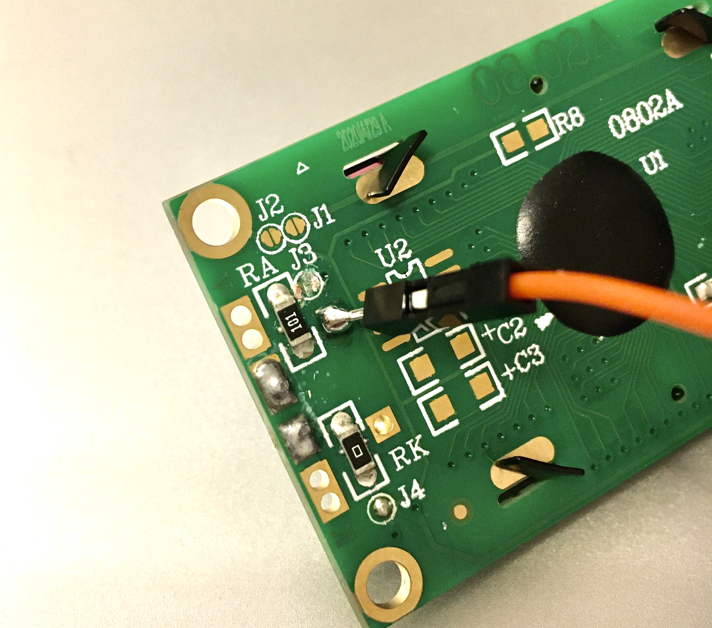
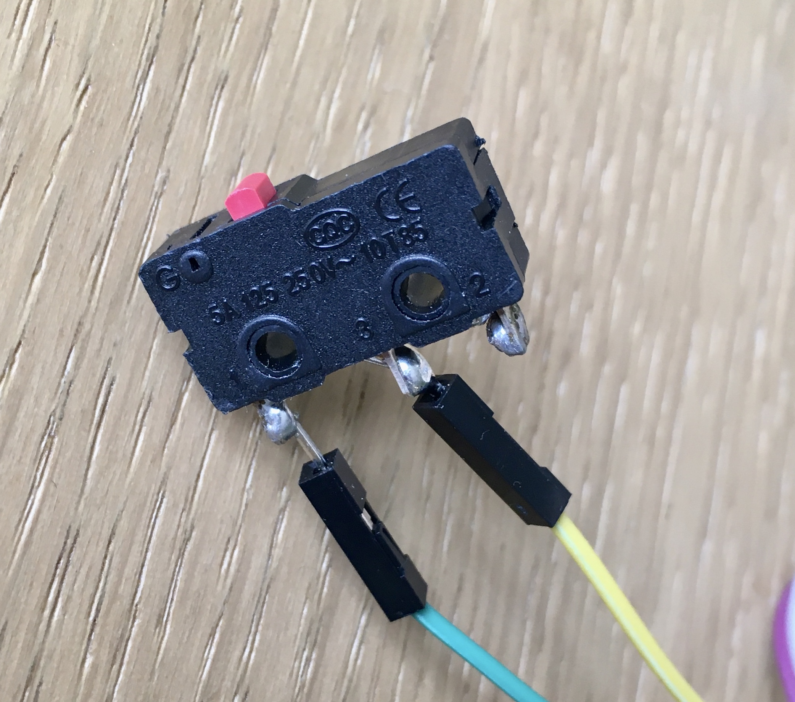
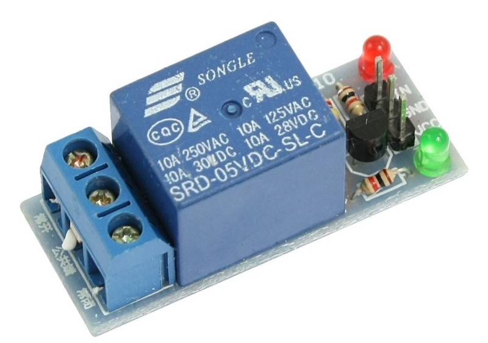
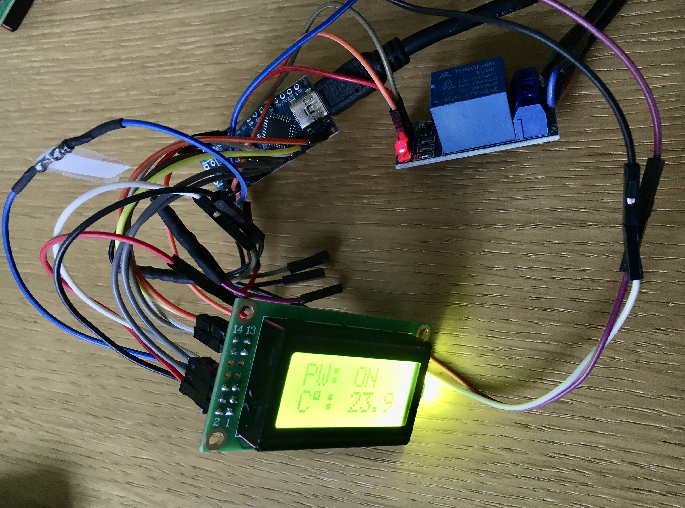

### Setting up and assembling a basic programmable thermostat with a small LCD display which senses the temperature of a physical system and performs actions so that the system's temperature is maintained near a desired setpoint. 
### A work in progress...

# Setting everything up

## Setting up and wiring 0802-A 14pin LCD

### Here's how the LCD board looks like

It has 14 pins stacked on the left of the display.

### After soldering some headers to the LCD board I connected these pins to my Arduino Nano like this:

<table>
  <tr>
    <th>0802-A LCD 14pin pinout </th>
    <th>Connect to Arduino pin</th>
  </tr>
  <tr>
    <td>1 Vss - Power supply (GND)</td>
    <td>GND</td>
  </tr>
  <tr>
    <td>2 Vdd - Power supply (+)</td>
    <td>5V</td>
  </tr>
  <tr>
    <td>3 Vo - Contrast adjust</td>
    <td>GND via 430ohm resistor</td>
  </tr>
  <tr>
    <td>4 RS - Register select signal</td>
    <td>D7</td>
  </tr>
  <tr>
    <td>5 R/W - Data read / write</td>
    <td>GND</td>
  </tr>
  <tr>
    <td>6 E - Enable signal</td>
    <td>D8</td>
  </tr>
  <tr>
    <td>7 DB0 - Data bus line</td>
    <td>Not connected</td>
  </tr>
  <tr>
    <td>8 DB1 - Data bus line</td>
    <td>Not connected</td>
  </tr>
  <tr>
    <td>9 DB2 - Data bus line</td>
    <td>Not connected</td>
  </tr>
  <tr>
    <td>10 DB3 - Data bus line</td>
    <td>Not connected</td>
  </tr>
  <tr>
    <td>11 DB4 - Data bus line</td>
    <td>D9</td>
  </tr>
  <tr>
    <td>12 DB5 - Data bus line</td>
    <td>D10</td>
  </tr>
  <tr>
    <td>13 DB6 - Data bus line</td>
    <td>D11</td>
  </tr>
  <tr>
    <td>14 DB7 - Data bus line</td>
    <td>D12</td>
  </tr>
</table>

### And ran the sample code:

    #include <LiquidCrystal.h>

    LiquidCrystal lcd(7, 8, 9, 10, 11, 12);   // put your Arduino pin numbers here

    void setup()
      {
      lcd.begin(8, 2); 
      lcd.print("this");
      lcd.setCursor(0,1);
      lcd.print("works!");
      }

    void loop()
      {
        // do nothing in 'loop'
      }

### If display is wired correctly you should see this:

### If you wish to control the backlight of the display
The backlight is automatically lit and is connected to pins 1 and 2 in common with the LCD. I ended up scraping the connection gently with a stanley knife and managed to cut the common connection. Then I soldered a wire to a connection just below the J3.

Now it would be possible to use a arduino pin or a button to control the display backlight. I used a simple button to do the job:

## Setting up and wiring a DS18B20 temperature sensor

### Here's how the temp sensor looks like

DS18B20 uses 1-wire communication.

<table>
  <tr>
    <th>DS18B20 pinout </th>
    <th>Connect to Arduino pin</th>
  </tr>
  <tr>
    <td>GND - Power supply (GND)</td>
    <td>GND</td>
  </tr>
  <tr>
    <td>Vdd - Power supply (+)</td>
    <td>5V</td>
  </tr>
  <tr>
    <td>Data - Communtication</td>
    <td>D4 via 4.7kohm resistor between D4 and 5V</td>
  </tr>
</table>

### Sample code:

    #include <OneWire.h>
    #include <DallasTemperature.h>

    // Data wire is connected to the Arduino digital pin 4
    #define ONE_WIRE_BUS 4

    // Setup a oneWire instance to communicate with any OneWire devices
    OneWire oneWire(ONE_WIRE_BUS);

    // Pass our oneWire reference to Dallas Temperature sensor 
    DallasTemperature sensors(&oneWire);

    void setup(void)
    {
      // Start serial communication for debugging purposes
      Serial.begin(9600);
      // Start up the library
      sensors.begin();
    }

    void loop(void){ 
      // Call sensors.requestTemperatures() to issue a global temperature and Requests to all devices on the bus
      sensors.requestTemperatures(); 
      
      Serial.print("Celsius temperature: ");
      Serial.println(sensors.getTempCByIndex(0), 1); 
      delay(3000);
    }

More detailed tutorial: https://create.arduino.cc/projecthub/TheGadgetBoy/ds18b20-digital-temperature-sensor-and-arduino-9cc806

## Setting up and wiring a 5V relay module

### Here's how the relay module looks like

It has one input connection.

<table>
  <tr>
    <th>Relay pinout </th>
    <th>Connect to Arduino pin</th>
  </tr>
  <tr>
    <td>GND - Power supply (GND)</td>
    <td>GND</td>
  </tr>
  <tr>
    <td>Vcc - Power supply (+)</td>
    <td>5V</td>
  </tr>
  <tr>
    <td>IN - Input</td>
    <td>D2</td>
  </tr>
</table>

# Assembling everything together to make a thermostat

Everything bundeled up and ready for testing.

    ### thermostat.ino code:

    #include <LiquidCrystal.h>
    #include <OneWire.h>
    #include <DallasTemperature.h>

    // Temperature sensor connection on pin 4
    #define ONE_WIRE_BUS 4

    float temperature;
    int thermostat_setting = 37; //if gets higher than 37 degrees switches power off

    OneWire oneWire(ONE_WIRE_BUS);
    DallasTemperature sensors(&oneWire);

    //Display connections
    //LiquidCrystal  (RS, E, D4, D5, D6, D7);
    LiquidCrystal lcd(7, 8, 9, 10, 11, 12); 

    void setup()
      {
      //Relay pin 2
      pinMode(2,OUTPUT);
      digitalWrite(2,LOW);
      Serial.begin(9600);
      sensors.begin();
        
      lcd.begin(8, 2);
      lcd.setCursor(0,0);
      lcd.print("POWER:");
      lcd.setCursor(0,1);
      lcd.print("TEMP:");
      delay(2000);
      }

    void loop()
      { 
      sensors.requestTemperatures();
      temperature = sensors.getTempCByIndex(0);
      Serial.println(temperature, 1);

      if (temperature < thermostat_setting) {
        digitalWrite(2,HIGH); 
        lcd.setCursor(0,0);
        lcd.print("PW: ");
        lcd.print("ON ");
        lcd.setCursor(0,1);
        lcd.print("C");
        lcd.print((char)223);
        lcd.print(": ");
        lcd.print(temperature, 1);
        delay(20000);
      }
      else {
        digitalWrite(2,LOW); 
        lcd.setCursor(0,0);
        lcd.print("PW: ");
        lcd.print("OFF");
        lcd.setCursor(0,1);
        lcd.print("C");
        lcd.print((char)223);
        lcd.print(": ");
        lcd.print(temperature, 1);
        // if temperature gets high cool off for a while
        delay(1800000);
      }
        
      }